# Alchemy Build System - Architecture Design

## Overview

**Alchemy** is a sophisticated build system inspired by the Android build system, designed to manage complex multi-platform software builds. It combines the simplicity of Android's module-based approach with Buildroot's ability to build open-source packages.


---

## Directory Structure

```mermaid
flowchart LR
    subgraph Root["📁 alchemy/"]
        direction TB
        
        subgraph Core["Core Makefiles"]
            M1[main.mk]
            M2[defs.mk]
            M3[variables.mk]
            M4[envsetup.mk]
            M5[target-setup.mk]
            M6[toolchain-setup.mk]
        end
        
        subgraph Build["Build Support"]
            B1[check.mk]
            B2[config-defs.mk]
            B3[config-rules.mk]
            B4[image.mk]
            B5[final.mk]
            B6[sdk.mk]
        end
        
        subgraph Dirs["Directories"]
            D1[📁 classes/]
            D2[📁 scripts/]
            D3[📁 targets/]
            D4[📁 toolchains/]
            D5[📁 kconfig/]
            D6[📁 doc/]
        end
    end
    
    style Root fill:#1a1a2e,stroke:#e94560
    style Core fill:#0f3460,stroke:#30363d
    style Build fill:#0f3460,stroke:#30363d
    style Dirs fill:#0f3460,stroke:#30363d
```



### Detailed Structure

| Directory | Purpose |
|-----------|---------|
| `classes/` | Module class definitions (EXECUTABLE, LIBRARY, AUTOTOOLS, CMAKE, etc.) |
| `scripts/` | Build helper scripts (alchemake.py, makefinal.py, mkfs.py, etc.) |
| `targets/` | Target OS configurations (linux, darwin, windows, ecos, baremetal) |
| `toolchains/` | Toolchain configurations and compiler flags |
| `kconfig/` | Configuration system (menuconfig) |
| `doc/` | Documentation files |

---

## Core Components

### 1. Build Entry Points

#### `alchemake` / `alchemake.py`
The main entry point for builds. Wraps GNU Make with:
- Error detection and early termination
- Parallel job management
- Process group handling for clean interruption
- Console control for interactive tools (ncurses)

#### `main.mk`
The core makefile that:
- Defines Alchemy version (1.3.10)
- Sets up build environment
- Scans workspace for `atom.mk` files
- Registers modules
- Generates build rules
- Orchestrates the complete build process

### 2. Module System

Modules are the fundamental building blocks. Each module is defined by an `atom.mk` file using `LOCAL_xxx` variables:

```makefile
LOCAL_PATH := $(call my-dir)
include $(CLEAR_VARS)

LOCAL_MODULE := my-module
LOCAL_SRC_FILES := src/main.c src/utils.c
LOCAL_CFLAGS := -Wall -Werror
LOCAL_LIBRARIES := dependency1 dependency2

include $(BUILD_EXECUTABLE)
```

#### Module Variables (`LOCAL_xxx`)
| Variable | Description |
|----------|-------------|
| `LOCAL_MODULE` | Module name |
| `LOCAL_SRC_FILES` | Source files to compile |
| `LOCAL_CFLAGS` | C compiler flags |
| `LOCAL_CXXFLAGS` | C++ compiler flags |
| `LOCAL_LDFLAGS` | Linker flags |
| `LOCAL_LDLIBS` | Libraries to link |
| `LOCAL_LIBRARIES` | Module dependencies |
| `LOCAL_EXPORT_CFLAGS` | Flags exported to dependents |

### 3. Module Classes


### 4. Target Configuration


### 5. Build Pipeline


### 6. Output Directory Structure


---

## Key Features

### Multi-Platform Support
- **Host Systems**: Linux, macOS
- **Target Systems**: Linux, Android, iOS, macOS, Windows, eCos, Baremetal
- **Architectures**: ARM, ARM64, x86, x64, AVR

### Build System Integration
- Native source compilation (C, C++, Fortran)
- GNU Autotools integration
- CMake integration
- Meson integration
- Qt/QMake integration
- Python package support

### Configuration System (kconfig)
- Linux-style configuration
- Menuconfig interface
- Dependencies and constraints
- Automatic configuration validation

### Advanced Features
- Parallel builds with proper error handling
- Incremental builds with dependency tracking
- Cross-compilation support
- SDK generation for external development
- Code coverage (gcov) support
- Debug symbol separation
- Multiple image formats (ext4, ubifs, cpio, tar, plf)

---

## Data Flow Diagram

```mermaid
flowchart TB
    subgraph DataFlow["📊 DATA FLOW"]
        direction TB
        
        A[("📄 atom.mk<br/>modules")] --> B[Scanner]
        B --> C[(Registry<br/>modules)]
        C --> D[Dependency<br/>Resolver]
        D --> A
        
        E[("⚙️ .config<br/>kconfig")] --> F[Config<br/>Processor]
        C --> F
        F --> G[Enabled<br/>Modules]
        
        H[("🔧 Toolchain<br/>Config")] --> I[Rule<br/>Generator]
        G --> I
        I --> J[Build<br/>Execution]
        
        J --> K[(Staging<br/>Directory)]
        J --> L[(Final<br/>Directory)]
        J --> M[(Symbols<br/>Directory)]
        
        L --> N[("💿 Image<br/>.ext4, .ubifs,<br/>.tar, ...")]
        
        K --> O[("📦 SDK<br/>Package")]
    end
    
    style DataFlow fill:#1a1a2e,stroke:#e94560,stroke-width:2px
    style A fill:#0f3460,stroke:#58a6ff
    style E fill:#0f3460,stroke:#3fb950
    style H fill:#0f3460,stroke:#d29922
    style N fill:#16213e,stroke:#f85149
    style O fill:#16213e,stroke:#a371f7
```



---

## Component Interaction


---

## Utility Macros (defs.mk)

| Macro | Description |
|-------|-------------|
| `my-dir` | Returns the directory of the current makefile |
| `path-from-top` | Converts absolute path to relative from top |
| `get-define` | Converts string to uppercase with underscores |
| `is-path-absolute` | Checks if path is absolute |
| `streq` / `strneq` | String equality comparison |
| `check-version` | Version comparison |
| `uniq` / `uniq2` | Remove duplicates from list |
| `is-var-defined` | Check if variable is defined |
| `is-item-in-list` | Check if item exists in list |

---

## License

- **Alchemy**: 3-clause BSD License
- **kconfig**: GPLv2 (from Linux kernel)

---

## References

- [Android Build System Documentation](android-build-system.html)
- [Android NDK Build System](android-mk.html)
- [Variables Reference](variables.mk)
- [Main Documentation](alchemy.mkd)
