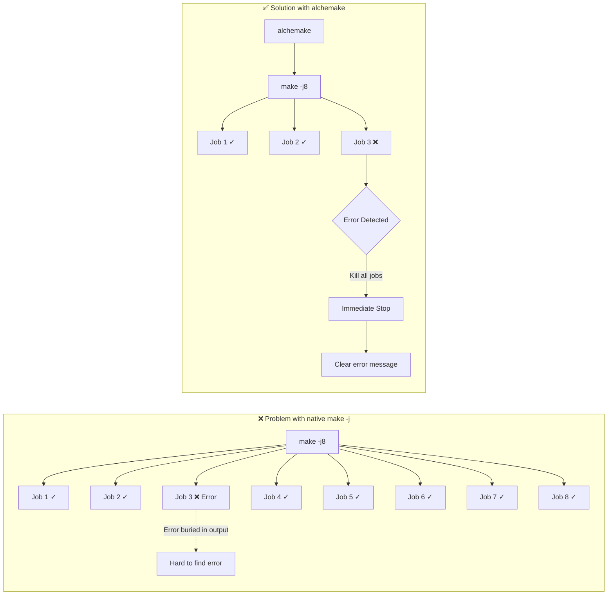
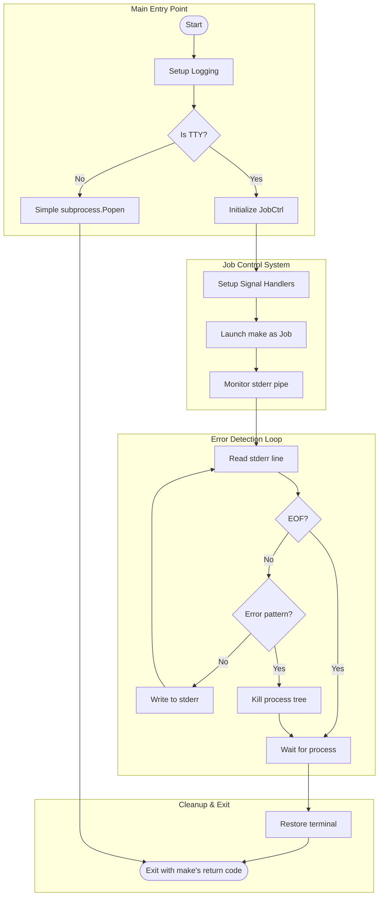
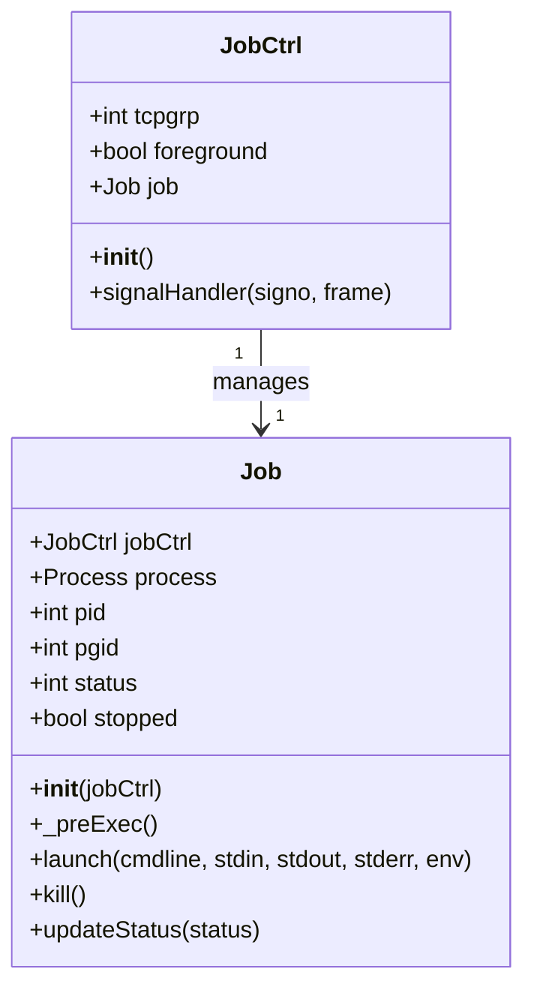
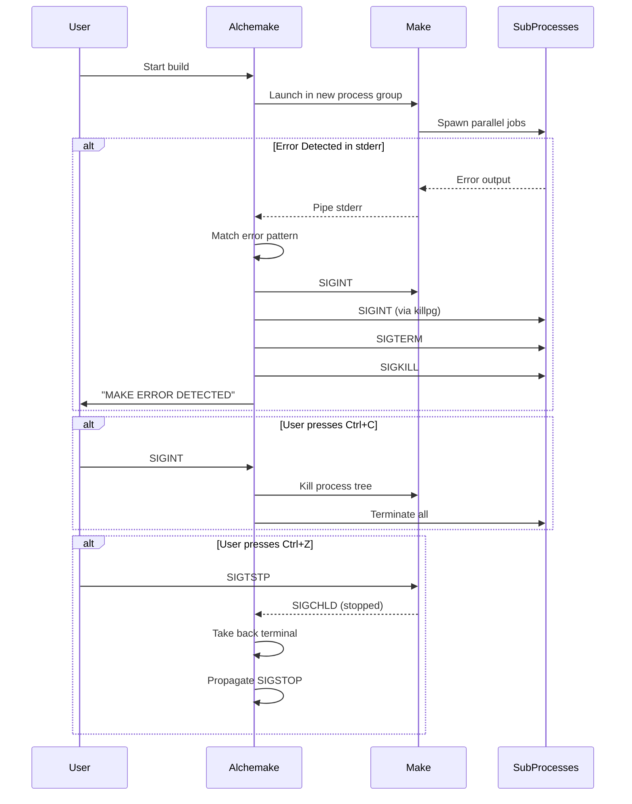
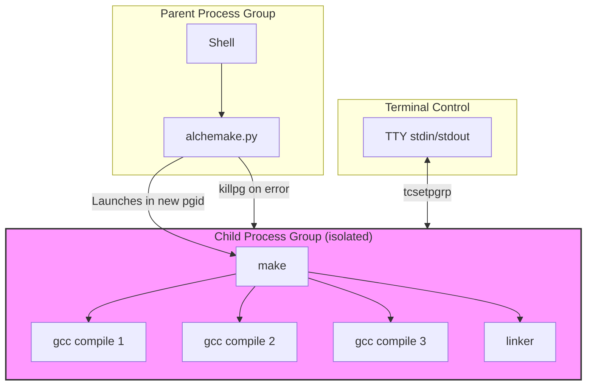

# Architecture Analysis: alchemake.py

## Overview

**alchemake.py** is a sophisticated Make wrapper script that provides **intelligent error detection and early termination** for parallel builds. It solves a common problem: when running `make -jN` (parallel jobs), the first-level Make doesn't immediately stop other jobs when one fails, causing users to wait a long time and scroll through extensive output to find the actual error.

## Core Purpose

## Architecture Overview

## Class Diagram

## Signal Handling Flow

## Process Group Management

## Error Detection Patterns

The script monitors stderr for these regex patterns:

| Pattern | Description |
|---------|-------------|
| `make: \*\*\* No rule to make target .*` | Missing target/dependency |
| `make: \*\*\* \[[^\[\]]*\] Error [0-9]+` | Recipe execution failure |

## Key Features

### 1. **Early Error Termination**
- Scans stderr in real-time for make error patterns
- Immediately kills entire process tree on first error
- Reduces wasted build time significantly

### 2. **Process Group Isolation**
- Child make runs in its own process group (`setpgid(0, 0)`)
- Allows clean termination of all descendant processes
- Prevents killing the wrapper script itself

### 3. **Terminal Control (TTY Handling)**
- Properly manages foreground/background process groups
- Handles `tcsetpgrp` for terminal ownership
- Supports ncurses-based tools (like `make menuconfig`)

### 4. **Signal Propagation**
- `SIGINT/SIGTERM`: Gracefully terminates build
- `SIGTSTP (Ctrl+Z)`: Properly suspends and resumes
- `SIGCONT`: Resumes child processes correctly
- `SIGCHLD`: Monitors child process state changes

### 5. **Graceful Degradation**
- Falls back to simple subprocess if not on TTY
- Works on non-interactive terminals and CI/CD pipelines

## Kill Sequence

## Environment Setup

| Variable | Value | Purpose |
|----------|-------|---------|
| `ALCHEMAKE_CMDLINE` | Full command | Debugging/tracing |
| `LC_MESSAGES` | `C` | Force English error messages |
| `LC_TIME` | `C` | Consistent time formatting |

## Source File Reference

- [alchemake.py](../scripts/alchemake.py) - Main script (294 lines)
- [alchemake](../scripts/alchemake) - Shell wrapper
- [alchemake-completion](../scripts/alchemake-completion) - Bash completion

## Constraints & Considerations

1. **Linux-specific**: Heavy use of POSIX signals and process groups
2. **TTY Required**: Full functionality needs interactive terminal
3. **Disk Wait Edge Case**: Cannot interrupt processes in uninterruptible I/O wait
4. **stderr only**: Only stderr is scanned; stdout passes through directly to support ncurses

## Recommendations

- Use `alchemake` instead of raw `make` for parallel builds
- Particularly useful with high `-j` values (e.g., `-j$(nproc)`)
- Works best in interactive terminal sessions
- For CI/CD, still works but with reduced job control features
