# Alchemy Build System - Architecture Documentation

> Generated: 2025-12-25

## Table of Contents
1. [Overview](#overview)
2. [Root Level .mk Files](#root-level-mk-files)
3. [Classes Folder Structure](#classes-folder-structure)
4. [Targets Folder Structure](#targets-folder-structure)
5. [Toolchains Folder Structure](#toolchains-folder-structure)
6. [Include Flow Diagrams](#include-flow-diagrams)
7. [Complete File Reference](#complete-file-reference)

---

## Overview

Alchemy is a GNU Make-based build system for cross-platform software compilation. It supports multiple target operating systems (Linux, Darwin, Windows, eCos, Baremetal) and various build systems (Autotools, CMake, Meson, QMake).

### Statistics

| Category | Count |
|----------|-------|
| Root .mk files | 22 |
| classes/ .mk files | 51 |
| targets/ .mk files | 26 |
| toolchains/ .mk files | 40 |
| Other .mk files | 6 |
| **Total** | **145** |

---

## Root Level .mk Files

### Main Architecture Flow

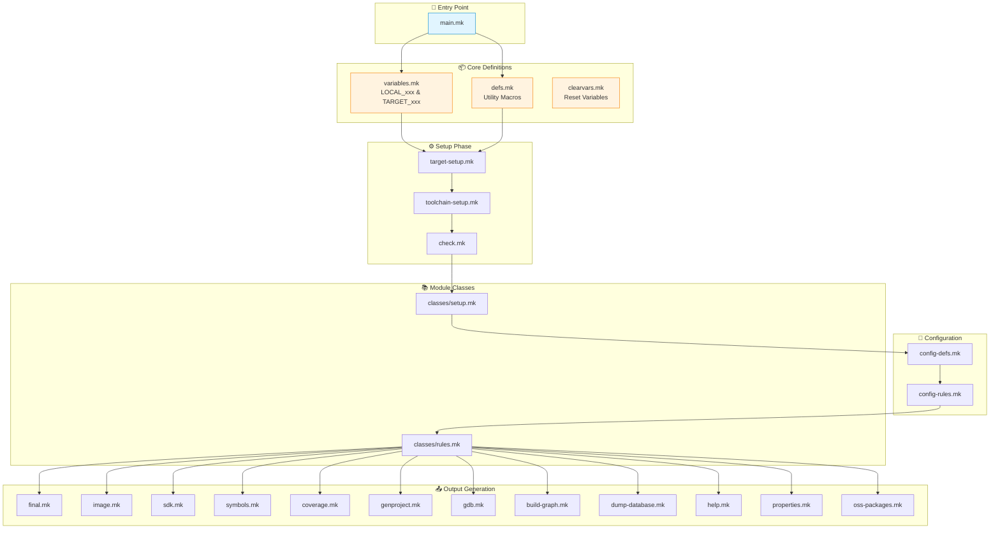

### Root .mk Files Relationships

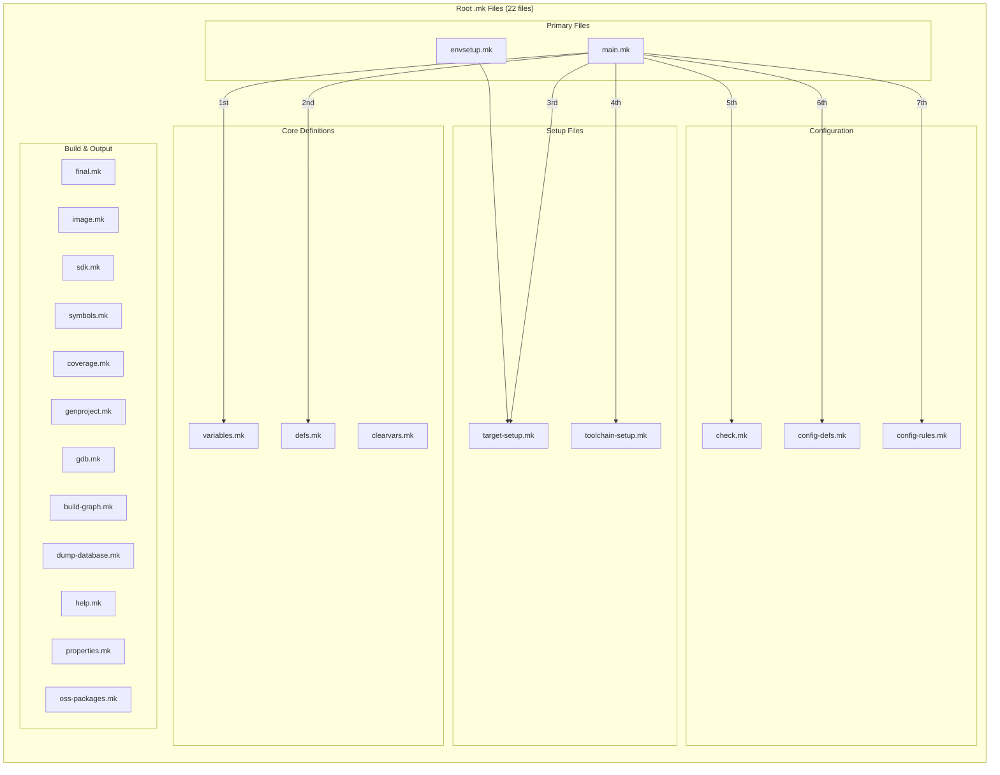

### Root Files Description Table

| File | Purpose | Dependencies |
|------|---------|--------------|
| `main.mk` | Master orchestrator - includes all files | All other .mk files |
| `variables.mk` | Defines LOCAL_xxx and TARGET_xxx lists | None |
| `defs.mk` | Utility macros (string, paths, etc.) | None |
| `clearvars.mk` | Clears LOCAL_xxx before module | variables.mk |
| `target-setup.mk` | Target OS/architecture detection | targets/setup.mk |
| `toolchain-setup.mk` | Compiler toolchain configuration | toolchains/setup.mk |
| `config-defs.mk` | Configuration system macros | defs.mk |
| `config-rules.mk` | Configuration check/update rules | config-defs.mk |
| `check.mk` | Build validation checks | defs.mk |
| `final.mk` | Final tree generation | All modules built |
| `image.mk` | Filesystem image generation | final.mk |
| `sdk.mk` | SDK generation | All modules |
| `symbols.mk` | Symbol extraction | All modules |
| `coverage.mk` | Code coverage helpers | All modules |
| `genproject.mk` | IDE project generation | All modules |
| `gdb.mk` | GDB debugging helpers | toolchain |
| `build-graph.mk` | Dependency graph generation | All modules |
| `dump-database.mk` | Database export | All modules |
| `help.mk` | Help target | None |
| `properties.mk` | Properties helpers | None |
| `oss-packages.mk` | OSS package helpers | All modules |
| `envsetup.mk` | Environment setup shortcut | target-setup.mk |

---

## Classes Folder Structure

### Classes Overview

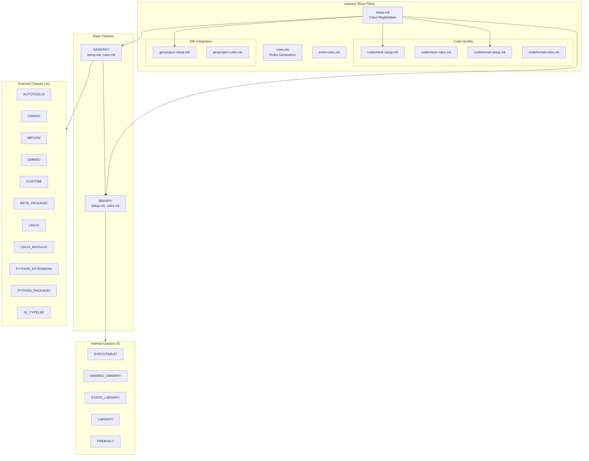

### Module Class Hierarchy

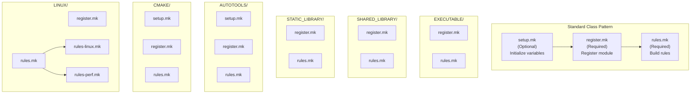

### All Classes - Complete File Inventory

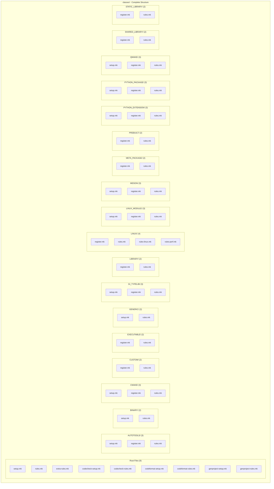

### Classes Description Table

| Class | Files | Purpose |
|-------|-------|---------|
| `GENERIC` | setup.mk, rules.mk | Base class for all modules |
| `BINARY` | setup.mk, rules.mk | Binary compilation (C/C++) |
| `EXECUTABLE` | register.mk, rules.mk | Executable programs |
| `SHARED_LIBRARY` | register.mk, rules.mk | Shared libraries (.so) |
| `STATIC_LIBRARY` | register.mk, rules.mk | Static libraries (.a) |
| `LIBRARY` | register.mk, rules.mk | Generic library (auto-detect) |
| `PREBUILT` | register.mk, rules.mk | Prebuilt binaries |
| `AUTOTOOLS` | setup.mk, register.mk, rules.mk | Autotools projects |
| `CMAKE` | setup.mk, register.mk, rules.mk | CMake projects |
| `MESON` | setup.mk, register.mk, rules.mk | Meson projects |
| `QMAKE` | setup.mk, register.mk, rules.mk | Qt/QMake projects |
| `CUSTOM` | register.mk, rules.mk | Custom build scripts |
| `META_PACKAGE` | register.mk, rules.mk | Meta packages (grouping) |
| `LINUX` | register.mk, rules.mk, rules-linux.mk, rules-perf.mk | Linux kernel builds |
| `LINUX_MODULE` | setup.mk, register.mk, rules.mk | Kernel modules |
| `PYTHON_EXTENSION` | setup.mk, register.mk, rules.mk | Python C extensions |
| `PYTHON_PACKAGE` | setup.mk, register.mk, rules.mk | Python packages |
| `GI_TYPELIB` | setup.mk, register.mk, rules.mk | GObject introspection |

---

## Targets Folder Structure

### Targets Overview

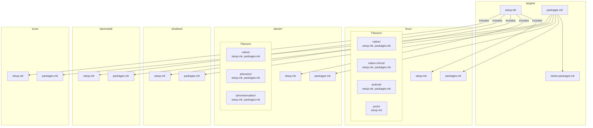

### Targets - Complete File Tree

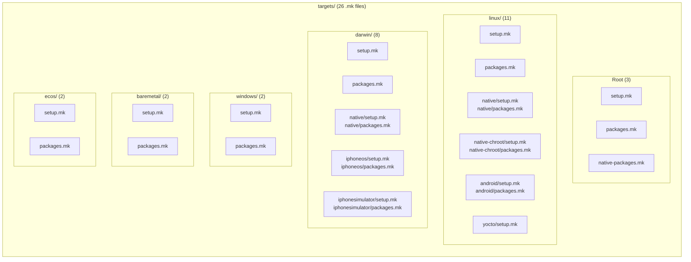

### Targets Description Table

| Target OS | Flavours | Files |
|-----------|----------|-------|
| **linux** | native, native-chroot, android, yocto | 11 .mk files |
| **darwin** | native, iphoneos, iphonesimulator | 8 .mk files |
| **windows** | - | 2 .mk files |
| **baremetal** | - | 2 .mk files |
| **ecos** | - | 2 .mk files |

---

## Toolchains Folder Structure

### Toolchains Overview

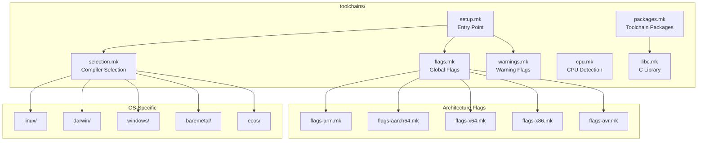

### Toolchains - Complete Structure

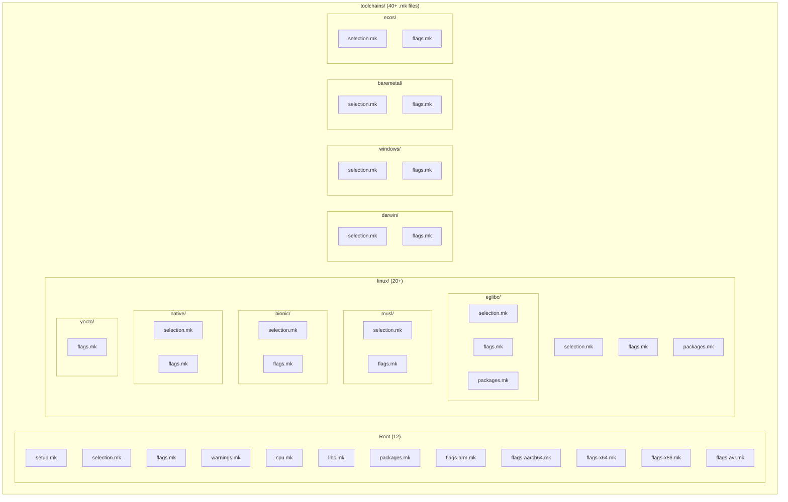

### Toolchain Selection Flow

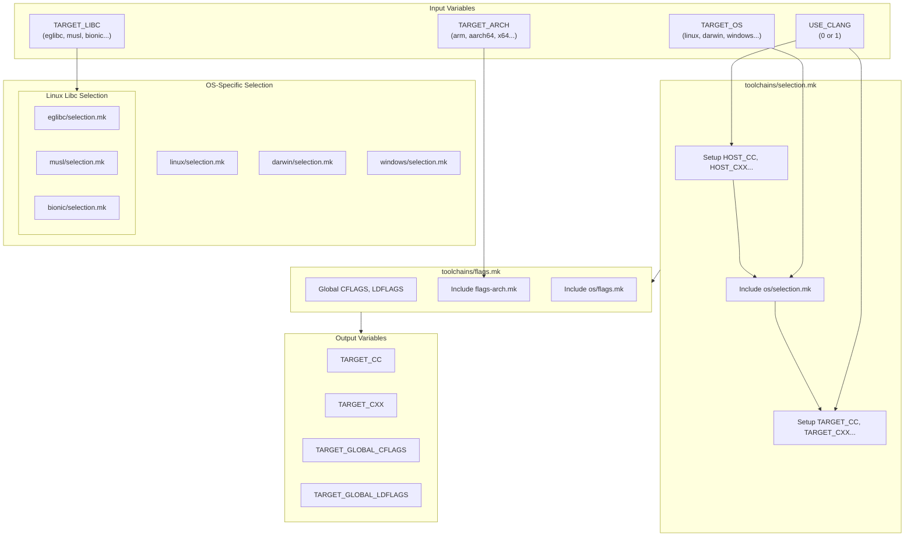

---

## Include Flow Diagrams

### Main Build Flow Sequence

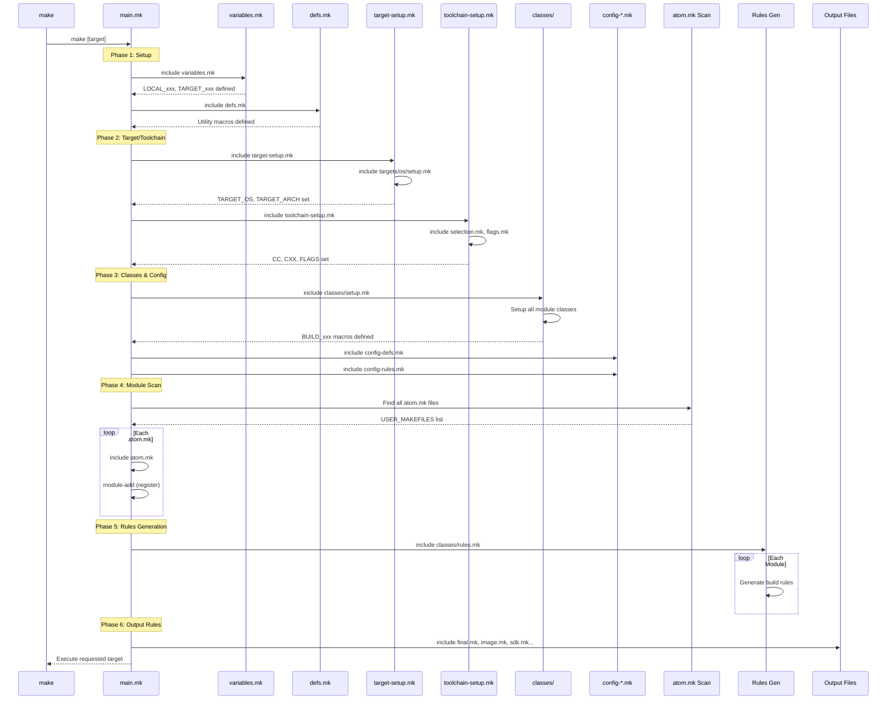

### Module Registration Flow

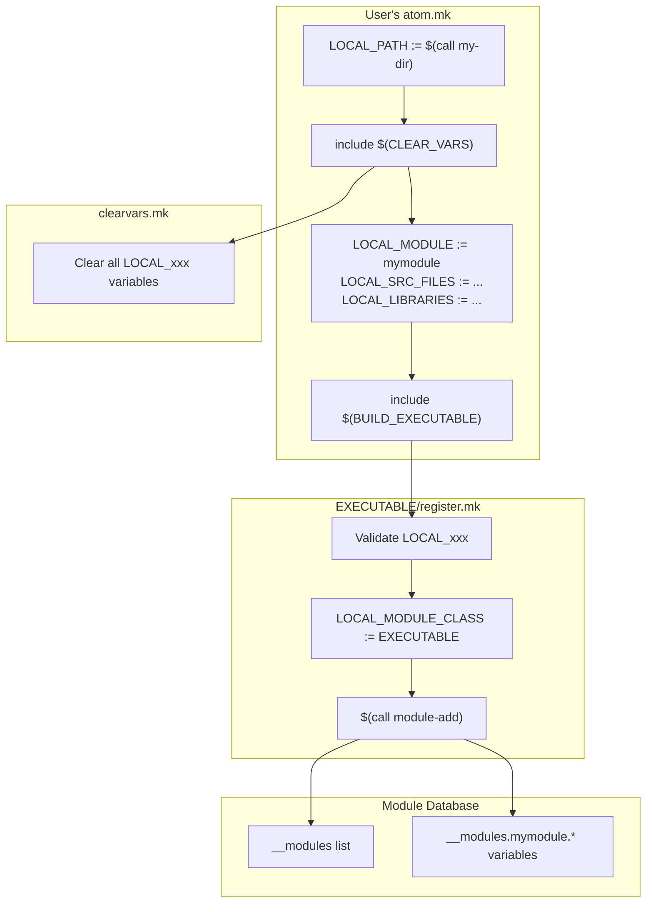

### atom.mk Template Flow

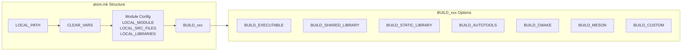

---

## Complete File Reference

### All .mk Files by Folder

| Folder | File | Purpose |
|--------|------|---------|
| **/** | main.mk | Master orchestrator |
| **/** | variables.mk | Variable definitions |
| **/** | defs.mk | Utility macros |
| **/** | clearvars.mk | Reset LOCAL_xxx |
| **/** | target-setup.mk | Target OS/arch setup |
| **/** | toolchain-setup.mk | Toolchain configuration |
| **/** | config-defs.mk | Config macros |
| **/** | config-rules.mk | Config rules |
| **/** | check.mk | Validation |
| **/** | final.mk | Final tree generation |
| **/** | image.mk | Image generation |
| **/** | sdk.mk | SDK generation |
| **/** | symbols.mk | Symbol extraction |
| **/** | coverage.mk | Code coverage |
| **/** | genproject.mk | IDE project generation |
| **/** | gdb.mk | GDB helpers |
| **/** | build-graph.mk | Dependency graph |
| **/** | dump-database.mk | Database export |
| **/** | help.mk | Help target |
| **/** | properties.mk | Properties helpers |
| **/** | oss-packages.mk | OSS package helpers |
| **/** | envsetup.mk | Environment setup |
| **classes/** | setup.mk | Class registration |
| **classes/** | rules.mk | Rules generation |
| **classes/** | extra-rules.mk | Extra rules |
| **classes/** | codecheck-setup.mk | Code check setup |
| **classes/** | codecheck-rules.mk | Code check rules |
| **classes/** | codeformat-setup.mk | Code format setup |
| **classes/** | codeformat-rules.mk | Code format rules |
| **classes/** | genproject-setup.mk | Project gen setup |
| **classes/** | genproject-rules.mk | Project gen rules |
| **classes/GENERIC/** | setup.mk, rules.mk | Base class |
| **classes/BINARY/** | setup.mk, rules.mk | Binary compilation |
| **classes/EXECUTABLE/** | register.mk, rules.mk | Executable modules |
| **classes/SHARED_LIBRARY/** | register.mk, rules.mk | Shared libraries |
| **classes/STATIC_LIBRARY/** | register.mk, rules.mk | Static libraries |
| **classes/LIBRARY/** | register.mk, rules.mk | Generic library |
| **classes/PREBUILT/** | register.mk, rules.mk | Prebuilt binaries |
| **classes/AUTOTOOLS/** | setup.mk, register.mk, rules.mk | Autotools projects |
| **classes/CMAKE/** | setup.mk, register.mk, rules.mk | CMake projects |
| **classes/MESON/** | setup.mk, register.mk, rules.mk | Meson projects |
| **classes/QMAKE/** | setup.mk, register.mk, rules.mk | Qt/QMake projects |
| **classes/CUSTOM/** | register.mk, rules.mk | Custom build |
| **classes/META_PACKAGE/** | register.mk, rules.mk | Meta packages |
| **classes/LINUX/** | register.mk, rules.mk, rules-linux.mk, rules-perf.mk | Linux kernel |
| **classes/LINUX_MODULE/** | setup.mk, register.mk, rules.mk | Kernel modules |
| **classes/PYTHON_EXTENSION/** | setup.mk, register.mk, rules.mk | Python C extensions |
| **classes/PYTHON_PACKAGE/** | setup.mk, register.mk, rules.mk | Python packages |
| **classes/GI_TYPELIB/** | setup.mk, register.mk, rules.mk | GObject introspection |
| **targets/** | setup.mk, packages.mk, native-packages.mk | Target setup |
| **targets/linux/** | setup.mk, packages.mk | Linux target |
| **targets/linux/native/** | setup.mk, packages.mk | Native Linux |
| **targets/linux/native-chroot/** | setup.mk, packages.mk | Chroot Linux |
| **targets/linux/android/** | setup.mk, packages.mk | Android |
| **targets/linux/yocto/** | setup.mk | Yocto Linux |
| **targets/darwin/** | setup.mk, packages.mk | macOS target |
| **targets/darwin/native/** | setup.mk, packages.mk | Native macOS |
| **targets/darwin/iphoneos/** | setup.mk, packages.mk | iOS |
| **targets/darwin/iphonesimulator/** | setup.mk, packages.mk | iOS Simulator |
| **targets/windows/** | setup.mk, packages.mk | Windows target |
| **targets/baremetal/** | setup.mk, packages.mk | Baremetal |
| **targets/ecos/** | setup.mk, packages.mk | eCos |
| **toolchains/** | setup.mk, selection.mk, flags.mk, warnings.mk, cpu.mk, libc.mk, packages.mk | Toolchain setup |
| **toolchains/** | flags-arm.mk, flags-aarch64.mk, flags-x64.mk, flags-x86.mk, flags-avr.mk | Arch flags |
| **toolchains/linux/** | selection.mk, flags.mk, packages.mk | Linux toolchain |
| **toolchains/linux/eglibc/** | selection.mk, flags.mk, packages.mk | eglibc |
| **toolchains/linux/musl/** | selection.mk, flags.mk | musl |
| **toolchains/linux/bionic/** | selection.mk, flags.mk | Android bionic |
| **toolchains/linux/native/** | selection.mk, flags.mk | Native toolchain |
| **toolchains/linux/yocto/** | flags.mk | Yocto toolchain |
| **toolchains/darwin/** | selection.mk, flags.mk | macOS toolchain |
| **toolchains/windows/** | selection.mk, flags.mk | Windows toolchain |
| **toolchains/baremetal/** | selection.mk, flags.mk | Baremetal toolchain |
| **toolchains/ecos/** | selection.mk, flags.mk | eCos toolchain |
| **packages/helloworld/** | atom.mk | Example package |
| **products/dragonwing-qcs6490/** | setup.mk, product.mk, toolchain-setup.mk | Product config |
| **kconfig/** | atom.mk | Kconfig module |
| **doc/** | python-native-atom.mk | Documentation example |

---

## Key Design Principles

### 1. Separation of Concerns
- **Core definitions** (variables.mk, defs.mk) are isolated from build logic
- **Target setup** is separate from **toolchain setup**
- **Module classes** are self-contained with setup/register/rules pattern

### 2. Hierarchical Organization
- OS-specific code lives in `targets/<os>/` and `toolchains/<os>/`
- Architecture flags are isolated in `flags-<arch>.mk`
- Libc variants have dedicated subfolders

### 3. Extensibility
- New module classes follow the standard pattern
- New targets/toolchains can be added without modifying core files
- Products define their specific configuration in `products/<name>/`

### 4. Build Phases
1. **Setup Phase**: Environment detection and configuration
2. **Scan Phase**: Find all atom.mk modules
3. **Registration Phase**: Build module database
4. **Rules Phase**: Generate make rules
5. **Execution Phase**: Build requested targets

---

## Version Information

- **Alchemy Version**: 1.3.10
- **Documentation Generated**: 2025-12-25
