# SDK & Toolchain Setup Guide for Alchemy

## Overview

This guide explains how to configure and use **toolchains** (cross-compilers) and **SDKs** (pre-built libraries/binaries) in the Alchemy build system.

```mermaid
flowchart LR
    subgraph Toolchain["🔧 TOOLCHAIN"]
        TC[Cross-Compiler]
        TC --> CC[gcc/clang]
        TC --> LD[Linker]
        TC --> AR[Archiver]
    end
    
    subgraph SDK["📦 SDK"]
        SK[Pre-built Packages]
        SK --> LIB[Libraries]
        SK --> HDR[Headers]
        SK --> BIN[Binaries]
    end
    
    subgraph Alchemy["⚗️ ALCHEMY"]
        BUILD[Build System]
    end
    
    Toolchain --> Alchemy
    SDK --> Alchemy
    Alchemy --> OUT[Target Output]
```



---

## Part 1: Toolchain Configuration

### Architecture Overview


### Key Variables

| Variable | Description | Example |
|----------|-------------|---------|
| `TARGET_CROSS` | Toolchain prefix | `arm-linux-gnueabihf-` |
| `TARGET_CC` | C compiler | `$(TARGET_CROSS)gcc` |
| `TARGET_CXX` | C++ compiler | `$(TARGET_CROSS)g++` |
| `TARGET_AR` | Archiver | `$(TARGET_CROSS)ar` |
| `TARGET_LD` | Linker | `$(TARGET_CROSS)ld` |
| `TARGET_ARCH` | Target architecture | `arm`, `aarch64`, `x64` |
| `TARGET_OS` | Target OS | `linux`, `darwin`, `windows` |
| `TARGET_LIBC` | C library | `glibc`, `musl`, `eglibc` |

### Example: Configure ARM Cross-Toolchain

#### Step 1: Set Environment Variables

```bash
# In your shell or product configuration
export ALCHEMY_TARGET_CROSS=arm-linux-gnueabihf-
export ALCHEMY_TARGET_ARCH=arm
```

#### Step 2: Create Product Configuration

Create `products/my-product/toolchain-setup.mk`:

```makefile
# Toolchain prefix (path to cross-compiler)
TARGET_CROSS := /opt/toolchains/arm-linux-gnueabihf/bin/arm-linux-gnueabihf-

# Architecture settings
TARGET_ARCH := arm
TARGET_CPU := cortex-a9
TARGET_FLOAT_ABI := hard

# Global compilation flags
TARGET_GLOBAL_CFLAGS += \
    -mcpu=$(TARGET_CPU) \
    -mfpu=neon \
    -mfloat-abi=$(TARGET_FLOAT_ABI)

# Global linker flags
TARGET_GLOBAL_LDFLAGS += \
    -mcpu=$(TARGET_CPU)
```

#### Step 3: Verify Configuration

```bash
# Build and check toolchain detection
./build.sh -p my-product -t all -j8

# Check detected triplet
make dump-config | grep TOOLCHAIN_TRIPLET
```

---

## Part 2: SDK Configuration

### SDK Workflow


### Generating an SDK

```bash
# Build your base product first
./build.sh -p base-product -t all -j8

# Generate SDK
make sdk

# Output locations:
#   - $(TARGET_OUT)/sdk/           <- SDK directory
#   - $(TARGET_OUT)/sdk-*.tar.gz   <- SDK archive
```

### SDK Directory Structure

```
sdk/
├── atom.mk                 # Module definitions (auto-generated)
├── setup.mk                # Toolchain setup (auto-generated)
├── toolchain-setup.mk      # Toolchain variables
├── host/                   # Host tools (copied to HOST_OUT_STAGING)
│   ├── bin/
│   └── lib/
└── staging/                # Target libraries and headers
    ├── lib/
    ├── usr/
    │   ├── include/
    │   └── lib/
    └── ...
```

### Using an SDK

#### Method 1: Environment Variable

```bash
# Set SDK directory
export ALCHEMY_TARGET_SDK_DIRS=/path/to/sdk

# Build with SDK
./build.sh -p my-product -t all -j8
```

#### Method 2: Product Configuration

In `products/my-product/setup.mk`:

```makefile
# Single SDK
TARGET_SDK_DIRS := /path/to/sdk

# Multiple SDKs (space-separated)
TARGET_SDK_DIRS := \
    /path/to/sdk1 \
    /path/to/sdk2
```

---

## Complete Example: Cross-compilation with SDK

### Scenario

Build an application for ARM target using:
1. A cross-toolchain for ARM Cortex-A53
2. An SDK with pre-built libraries (OpenCV, Qt, etc.)

```mermaid
flowchart TB
    subgraph Host["🖥️ Host Machine (x86_64)"]
        ALCHEMY[Alchemy Build System]
        TOOLCHAIN[ARM Toolchain<br/>/opt/arm-toolchain]
        SDK[Pre-built SDK<br/>/opt/arm-sdk]
    end
    
    subgraph Config["⚙️ Configuration"]
        PRODUCT[products/my-arm-app/]
        SETUP[setup.mk]
        TC_SETUP[toolchain-setup.mk]
    end
    
    subgraph Build["🔨 Build Process"]
        SRC[Source Code<br/>atom.mk] --> COMPILE
        TOOLCHAIN --> COMPILE[Cross-Compile]
        SDK --> |Headers + Libs| COMPILE
        COMPILE --> OUT[ARM Binary]
    end
    
    Host --> Config
    Config --> Build
```



### Step-by-Step Setup

#### 1. Install Toolchain

```bash
# Download and extract ARM toolchain
sudo mkdir -p /opt/toolchains
cd /opt/toolchains
wget https://releases.linaro.org/components/toolchain/binaries/latest-7/aarch64-linux-gnu/gcc-linaro-7.5.0-2019.12-x86_64_aarch64-linux-gnu.tar.xz
tar xf gcc-linaro-7.5.0-2019.12-x86_64_aarch64-linux-gnu.tar.xz

# Verify
/opt/toolchains/gcc-linaro-7.5.0-2019.12-x86_64_aarch64-linux-gnu/bin/aarch64-linux-gnu-gcc --version
```

#### 2. Create Product Directory

```bash
mkdir -p products/my-arm-app
```

#### 3. Create `products/my-arm-app/setup.mk`

```makefile
###############################################################################
# Product Setup for ARM Application
###############################################################################

# Product identification
TARGET_PRODUCT := my-arm-app
TARGET_PRODUCT_VARIANT := release

# Target platform
TARGET_OS := linux
TARGET_OS_FLAVOUR := generic
TARGET_ARCH := aarch64

# SDK directories (pre-built libraries)
TARGET_SDK_DIRS := /opt/sdk/arm-base-sdk

# Image format
TARGET_IMAGE_FORMAT := tar.gz

# Build options
TARGET_NOSTRIP_FINAL := 0
```

#### 4. Create `products/my-arm-app/toolchain-setup.mk`

```makefile
###############################################################################
# Toolchain Setup for ARM Cortex-A53
###############################################################################

# Toolchain location
TOOLCHAIN_ROOT := /opt/toolchains/gcc-linaro-7.5.0-2019.12-x86_64_aarch64-linux-gnu

# Cross-compiler prefix
TARGET_CROSS := $(TOOLCHAIN_ROOT)/bin/aarch64-linux-gnu-

# CPU-specific flags
TARGET_CPU := cortex-a53

TARGET_GLOBAL_CFLAGS += \
    -mcpu=$(TARGET_CPU) \
    -mtune=$(TARGET_CPU)

TARGET_GLOBAL_CXXFLAGS += \
    -mcpu=$(TARGET_CPU) \
    -mtune=$(TARGET_CPU)

TARGET_GLOBAL_LDFLAGS += \
    -mcpu=$(TARGET_CPU)

# Optional: Add SDK lib path to linker
ifdef TARGET_SDK_DIRS
TARGET_GLOBAL_LDFLAGS += \
    $(foreach sdk,$(TARGET_SDK_DIRS),-L$(sdk)/staging/usr/lib)
endif
```

#### 5. Create Application Module (`my-app/atom.mk`)

```makefile
LOCAL_PATH := $(call my-dir)

include $(CLEAR_VARS)

LOCAL_MODULE := my-arm-app
LOCAL_CATEGORY_PATH := apps

LOCAL_SRC_FILES := \
    main.c \
    utils.c

# Dependencies from SDK (automatically resolved)
LOCAL_LIBRARIES := \
    opencv_core \
    pthread

LOCAL_CFLAGS := -Wall -Wextra

include $(BUILD_EXECUTABLE)
```

#### 6. Build

```bash
# Configure and build
./build.sh -p my-arm-app -t my-arm-app -j$(nproc)

# Generate final image
make image

# Check output
file out/my-arm-app-release/staging/usr/bin/my-arm-app
# Should show: ELF 64-bit LSB executable, ARM aarch64
```

---

## Troubleshooting

### Common Issues

```mermaid
flowchart TB
    subgraph Issues["⚠️ Common Problems"]
        I1[Compiler not found]
        I2[Missing libraries]
        I3[Wrong architecture]
        I4[SDK incompatible]
    end
    
    subgraph Solutions["✅ Solutions"]
        S1[Check TARGET_CROSS path]
        S2[Verify TARGET_SDK_DIRS]
        S3[Check TARGET_ARCH]
        S4[Rebuild SDK with same toolchain]
    end
    
    I1 --> S1
    I2 --> S2
    I3 --> S3
    I4 --> S4
```



### Debug Commands

```bash
# Show all TARGET variables
make dump-config | grep TARGET_

# Show toolchain info
make dump-config | grep -E "(CROSS|TOOLCHAIN|CC|CXX)"

# Show SDK configuration
make dump-config | grep SDK

# Verbose build to see actual commands
make V=1 my-module

# Check module dependencies
make <module>-depends
```

### Verify Toolchain Detection

```bash
# Check compiler triplet
$(TARGET_CROSS)gcc -dumpmachine
# Expected: aarch64-linux-gnu (or similar)

# Check sysroot
$(TARGET_CROSS)gcc -print-sysroot

# Check search paths
$(TARGET_CROSS)gcc -print-search-dirs
```

---

## Advanced Configuration

### Using Clang Instead of GCC

```makefile
# In toolchain-setup.mk
TARGET_USE_CLANG := 1
TARGET_CC := clang
TARGET_CXX := clang++

# Cross-compilation with clang needs GCC toolchain for sysroot
TARGET_GLOBAL_CFLAGS_clang += \
    --target=aarch64-linux-gnu \
    --sysroot=$(TOOLCHAIN_ROOT)/aarch64-linux-gnu/libc \
    --gcc-toolchain=$(TOOLCHAIN_ROOT)
```

### SDK Public Modules

Control which modules are exported in SDK:

```makefile
# Only export specific modules
TARGET_SDK_PUBLIC_MODULES := \
    mylib \
    mylib-headers

# Allow SDK use with different compiler versions
TARGET_SDK_ALLOW_OLDER_CC := 1
TARGET_SDK_ALLOW_NEWER_CC := 1
```

---

## Quick Reference

| Task | Command/Variable |
|------|------------------|
| Set toolchain | `TARGET_CROSS := /path/to/prefix-` |
| Set architecture | `TARGET_ARCH := arm` |
| Add SDK | `TARGET_SDK_DIRS := /path/to/sdk` |
| Generate SDK | `make sdk` |
| Add compiler flags | `TARGET_GLOBAL_CFLAGS += -flag` |
| Add linker flags | `TARGET_GLOBAL_LDFLAGS += -flag` |
| Debug config | `make dump-config` |

---

## File References

| File | Purpose |
|------|---------|
| [toolchain-setup.mk](../../toolchain-setup.mk) | Main toolchain entry point |
| [toolchains/selection.mk](../../toolchains/selection.mk) | Compiler selection logic |
| [toolchains/flags.mk](../../toolchains/flags.mk) | Default compiler flags |
| [toolchains/setup.mk](../../toolchains/setup.mk) | Toolchain setup orchestration |
| [sdk.mk](../../sdk.mk) | SDK generation rules |
| [scripts/makesdk.py](../../scripts/makesdk.py) | SDK generation script |
